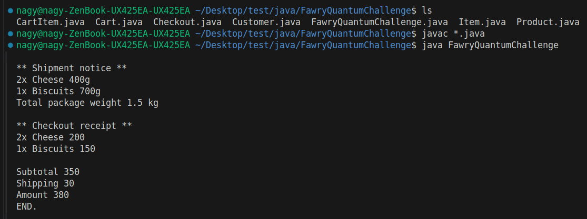

# Fawry Quantum E-Commerce System

This project is a simple e-commerce system designed for the Fawry Quantum Internship Challenge.  
It demonstrates product management, cart operations, checkout, and shipping logic.

## Class Overview

### Product (abstract)
- **Fields:** `name`, `price`, `quantity`
- **Description:** Base class for all products.

### Cheese, Biscuits
- **Extends:** `Product`
- **Implements:** `Shippable`, `Expirable`
- **Fields:** `weight`, `expiry`
- **Description:** Perishable and shippable products.

### TV
- **Extends:** `Product`
- **Implements:** `Shippable`
- **Fields:** `weight`
- **Description:** Shippable, non-expirable product.

### ScratchCard
- **Extends:** `Product`
- **Description:** Non-shippable, non-expirable product.

### Shippable (interface)
- **Methods:** `getName()`, `getWeight()`
- **Description:** For products that require shipping.

### Expirable (interface)
- **Methods:** `isExpired()`
- **Description:** For products that can expire.

### Customer
- **Fields:** `name`, `balance`
- **Methods:** `pay(int amount)`
- **Description:** Represents a customer with a balance.

### Cart
- **Fields:** List of `CartItem` or map of `Product` to quantity
- **Methods:** `add(Product, int)`, `isEmpty()`, `getItems()`
- **Description:** Holds products and quantities for checkout.

### CartItem
- **Fields:** `Product`, `quantity`
- **Methods:** `getTotalPrice()`, `getTotalWeight()`
- **Description:** Represents a product and its quantity in the cart.

### Checkout
- **Methods:** `checkout(Customer, Cart)`
- **Description:** Handles checkout logic, prints shipment and receipt, checks for errors.

### ShippingService
- **Methods:** `ship(List<Shippable>)`
- **Description:** Handles shipping of shippable products.

---

## How to Run

1. Compile all `.java` files:
   ```
   javac *.java
   ```
2. Run the main class:
   ```
   java FawryQuantumChallenge
   ```

---

## Example Output

```
** Shipment notice **
2x Cheese 400g
1x Biscuits 700g
Total package weight 1.1 kg

** Checkout receipt **
2x Cheese 200
1x Biscuits 150

Subtotal 350
Shipping 30
Amount 380
END.
```

---

## Terminal Example

Below is a screenshot of compiling and running the project:



---

## Notes

- The system checks for product expiry, stock, and customer balance.
- Only shippable items are included in the shipment notice.
- Only available and non-expired products can be added to the cart.